# The AI Gateway: An Orchestrator Pattern for AI Services

This document describes the **Orchestrator Agent** (or **AI Gateway**) pattern, a powerful architecture for building scalable, multi-capable AI systems using Spring AI. It explains how to create a central agent that can intelligently delegate tasks to a collection of specialized backend microservices.

## The Challenge: Scaling AI Capabilities

When building with AI, a common goal is to create a single interface that can answer a wide variety of questions. For example, a user might ask, "What's the weather at the delivery address for my most recent order?" Answering this requires two distinct capabilities: fetching order information and getting a weather forecast.

A naive approach might be to have a "main" AI agent try to have a conversation with an "order" agent and a "weather" agent. This is inefficient and unreliable. LLMs are designed to use tools, not to chat with other LLMs via API calls.

## The Solution: The Orchestrator Pattern

The Orchestrator pattern solves this by introducing a central **AI Gateway**. This gateway acts as the single point of contact for the user. It is aware of all the "tools" available across the entire system and uses a powerful LLM to decide which tools to use in what order to satisfy the user's request.

### Core Components

1.  **Specialized Microservices**: These are your standard backend services (e.g., Order Service, Customer Service, Weather Service). They expose well-defined, machine-readable APIs (like REST) and contain the core business logic. They do not need any AI-specific code.

2.  **The AI Gateway (Orchestrator)**: This is a dedicated Spring Boot application that serves as the brain of the operation.
    *   It exposes a single `/chat` endpoint to the end-user.
    *   It contains a collection of `FunctionCallback` beans. Each bean is a wrapper around a REST client call to one of the specialized microservices.
    *   It uses a `ChatModel` configured with the **entire set** of `FunctionCallback`s, giving the LLM a complete view of all available system capabilities.

### How It Works: A Step-by-Step Flow

When the AI Gateway receives a complex query, it follows a multi-step process orchestrated by the LLM.

```mermaid
sequenceDiagram
    participant User
    participant "AI Gateway (/chat)" as Gateway
    participant "Order Service API" as OrderSvc
    participant "Weather Service API" as WeatherSvc
    participant "LLM"

    User->>Gateway: "What's the weather at the<br/>delivery address for order #123?"

    Gateway->>LLM: call(prompt, functions=["getOrderStatus", "getWeatherForecast"])
    LLM-->>Gateway: Respond: Must call getOrderStatus(orderId="123")

    Gateway->>OrderSvc: GET /api/orders/123
    OrderSvc-->>Gateway: Return JSON: { "address": "123 Main St" }

    Gateway->>LLM: call(prompt, function_result="Address is 123 Main St")
    LLM-->>Gateway: Respond: Must call getWeatherForecast(location="123 Main St")

    Gateway->>WeatherSvc: GET /api/forecast?location=123%20Main%20St
    WeatherSvc-->>Gateway: Return JSON: { "forecast": "Sunny, 75°F" }

    Gateway->>LLM: call(prompt, function_result="Forecast is Sunny, 75°F")
    LLM-->>Gateway: Respond: "The weather at the delivery<br/>address for order #123 is Sunny, 75°F."

    Gateway-->>User: "The weather at the delivery address is Sunny, 75°F."
```



### Implementation with Spring AI

Implementing this pattern in Spring AI is a natural extension of the single-service function calling pattern.

1.  **Define REST Clients**: In your AI Gateway project, create Spring beans (e.g., using `RestClient` or `WebClient`) that are configured to call the APIs of your downstream microservices.

    ```java
    @Configuration
    class ApiClients {
        @Bean
        public RestClient orderApiClient(@Value("${services.orders.url}") String baseUrl) {
            return RestClient.builder().baseUrl(baseUrl).build();
        }

        @Bean
        public RestClient weatherApiClient(@Value("${services.weather.url}") String baseUrl) {
            return RestClient.builder().baseUrl(baseUrl).build();
        }
    }
    ```

2.  **Create `FunctionCallback` Wrappers**: For each downstream API endpoint you want to expose as a tool, create a `FunctionCallback` bean. The function's logic will simply call the appropriate REST client.

    ```java
    @Configuration
    class ToolConfiguration {

        // A record to define the input for our function
        public record OrderRequest(String orderId) {}

        @Bean
        @Description("Get the full status of a specific order by its ID")
        public FunctionCallback getOrderStatus(RestClient orderApiClient) {
            return FunctionCallbackWrapper
                .builder((OrderRequest req) -> {
                    // This is where you call your microservice
                    return orderApiClient.get()
                        .uri("/orders/{orderId}", req.orderId())
                        .retrieve()
                        .body(String.class);
                })
                .withName("getOrderStatus")
                .withInputType(OrderRequest.class)
                .build();
        }

        // ... more FunctionCallback beans for weather, customer lookups, etc.
    }
    ```

3.  **Orchestrate in the Controller**: Your chat controller collects all `FunctionCallback` beans and provides them to the `ChatModel` on every call.

    ```java
    @RestController
    class ChatController {

        private final ChatModel chatModel;
        private final List<FunctionCallback> functionCallbacks;
        private final Set<String> functionNames;

        // Spring injects all FunctionCallback beans into this list
        ChatController(ChatModel chatModel, List<FunctionCallback> functionCallbacks) {
            this.chatModel = chatModel;
            this.functionCallbacks = functionCallbacks;
            this.functionNames = functionCallbacks.stream()
                .map(FunctionCallback::getName)
                .collect(Collectors.toSet());
        }

        @PostMapping("/chat")
        public String chat(@RequestBody String message) {
            OpenAiChatOptions options = OpenAiChatOptions.builder()
                .withFunctionCallbacks(functionCallbacks) // Provide all tools
                .withFunctions(functionNames)
                .build();

            ChatResponse response = chatModel.call(new Prompt(message, options));
            return response.getResult().getOutput().getContent();
        }
    }
    ```

## Benefits of the Orchestrator Pattern

-   **Scalability**: You can easily add new capabilities by deploying a new microservice and registering a corresponding tool function in the gateway.
-   **Separation of Concerns**: AI logic is centralized in the gateway. Backend services remain simple, focused, and testable without any AI dependencies.
-   **Efficiency**: Services communicate via optimized, direct API calls rather than slow and costly LLM-to-LLM conversations.
-   **Flexibility**: You can mix and match tools from any number of services to answer complex user queries. 