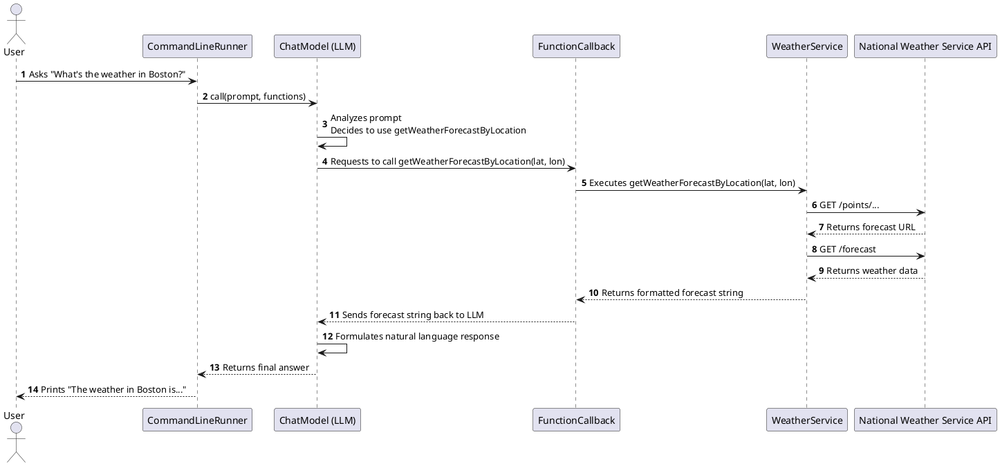

# My Weather Server

This project is a Spring Boot application that demonstrates the use of Spring AI's function calling capabilities. It provides a simple, interactive command-line interface to chat with an AI model that can use tools to fetch real-time weather information.

## Component Interaction Diagram



## Design

The application is designed to be a self-contained demonstration of AI tool-use.

- **`WeatherService`**: This is the core service that interacts with the public National Weather Service API (`https://api.weather.gov`). It contains the logic to fetch weather forecasts by location and retrieve active weather alerts for a given US state.

- **AI Tool Exposure**: The application exposes two key methods from the `WeatherService` as tools for an AI model:
  - `getWeatherForecastByLocation(latitude, longitude)`
  - `getAlerts(state)`
  
  These are registered in the Spring application context as `FunctionCallback` beans, which is the mechanism used in this version of Spring AI to make Java functions available to the AI.

- **Interactive Chat**: The `MyWeatherServerApplication` includes a `CommandLineRunner` bean that starts an interactive command-line chat session when the application runs. This allows you to directly interact with the AI model and test its ability to use the provided weather tools.

## The Spring AI Function Calling Pattern

This application demonstrates a powerful pattern for integrating AI with external tools and services. Here's how it works:

1.  **Define a Tool**: A "tool" is a simple Java `Function` that performs a specific, well-defined task (e.g., getting the weather, looking up a customer). In this project, the `WeatherService` methods provide the core logic for our tools.

2.  **Expose the Tool to the AI**: You can't just give the AI a Java function. You need to wrap it in a `FunctionCallback` and register it as a Spring `@Bean`. This wrapper provides the critical metadata (name, description, and input parameters) that the AI needs to understand what the tool does and how to use it.

3.  **Provide Tools at Call Time**: When you send a prompt to the `ChatModel`, you include the set of `FunctionCallback`s that are available for that specific request. The Large Language Model (LLM) analyzes both the user's prompt and the descriptions of the functions you provided.

4.  **AI Orchestration**: If the LLM determines that one of your functions can help answer the user's question, it doesn't execute the function itself. Instead, it returns a special response asking *your application* to run the function with a specific set of arguments (e.g., `{"latitude":37.7749,"longitude":-122.4194}`).

5.  **Execution and Response**: Spring AI intercepts this request, finds the correct `FunctionCallback` bean, executes your Java code with the arguments provided by the AI, and captures the result.

6.  **Final Answer**: This result is then sent *back* to the LLM in a new request. The LLM uses the information from your tool to formulate a final, human-readable answer and sends it back to the user.

This pattern allows you to augment the LLM's general knowledge with real-time, proprietary, or domain-specific information, making it dramatically more powerful and useful.

## Applying the Pattern to Enterprise Use Cases

This function-calling pattern is not just for simple demos; it's a powerful technique for creating AI-powered interfaces for existing enterprise systems.

Imagine you have a an existing **Order Management Microservice** with a well-defined REST API:
-   `GET /orders/{orderId}`
-   `GET /customers/{customerId}/orders`
-   `POST /orders/{orderId}/cancel`

You can build a new AI-enabled service, or add to the existing one, to provide a natural language layer on top of this API without changing its core logic.

### How to Apply

1.  **Create a Client for Your Existing API**: In your new AI service, create a standard REST client (using `RestClient` or `WebClient`) that knows how to call your Order Management microservice.

2.  **Define `FunctionCallback` Wrappers**: For each key API endpoint, create a corresponding `FunctionCallback` bean. Each function will call your API client.

    ```java
    @Bean
    @Description("Get the status of a specific order by its ID")
    public FunctionCallback getOrderStatus(OrderApiClient client) {
        return FunctionCallbackWrapper.builder(client::getOrderStatus)
            .withName("getOrderStatus")
            .withInputType(OrderStatusRequest.class)
            // ... and so on
            .build();
    }
    
    @Bean
    @Description("Cancel an order by its ID")
    public FunctionCallback cancelOrder(OrderApiClient client) {
        // ...
    }
    ```

3.  **Expose an AI Chat Endpoint**: Create a new REST endpoint in your AI service (e.g., `POST /chat`) that accepts natural language queries from users or client applications.

4.  **Orchestrate with the LLM**: When the `/chat` endpoint receives a request, it calls the `ChatModel`, providing it with the set of all `FunctionCallback`s that wrap your microservice's API.

Now, a user can simply ask:
-   "What's the status of order 12345?"
-   "Show me the last 5 orders for customer 9876."
-   "Please cancel order 54321."

The LLM will intelligently map these natural language requests to the appropriate function calls, execute them through your API client, and return a synthesized, easy-to-understand response. This allows you to rapidly develop powerful, AI-driven user experiences on top of your existing, battle-tested microservices.


## Setup and Run Instructions

Follow these steps to build and run the application.

### Prerequisites

- Java 17 or later
- Apache Maven

### 1. Configuration

The application requires an OpenAI API key to function.

- Open the `src/main/resources/application.properties` file.
- Add your OpenAI API key to the following property:

  ```properties
  spring.ai.openai.api-key=YOUR_API_KEY_HERE
  ```

### 2. Build the Application

Open a terminal in the `projects/my-weather-server` directory and run the following Maven command to build the project:

```bash
mvn clean install
```

This will compile the code and package it into a single executable JAR file in the `target` directory.

### 3. Run the Application

Once the build is complete, you can run the application using the following command:

```bash
java -jar target/my-weather-server-0.0.1-SNAPSHOT.jar
```

### 4. Interact with the AI

After running the command, you will see a prompt in your terminal:

```
Chat with the AI. Type 'exit' to quit.
User: 
```

You can now ask questions. The AI will automatically use the weather tools when appropriate.

**Example questions:**

- `What's the weather like in Boston, MA?`
- `Are there any weather alerts for CA?`
- `What is the forecast for San Francisco?`

To stop the application, simply type `exit` and press Enter. 